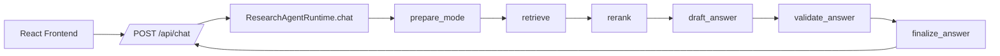
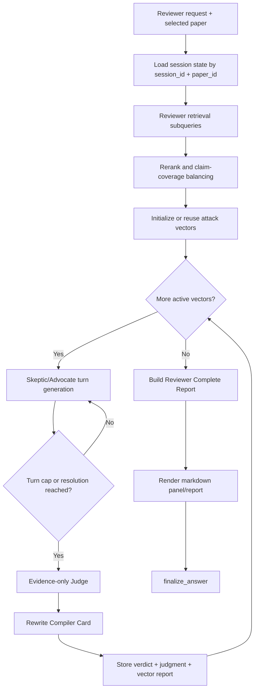
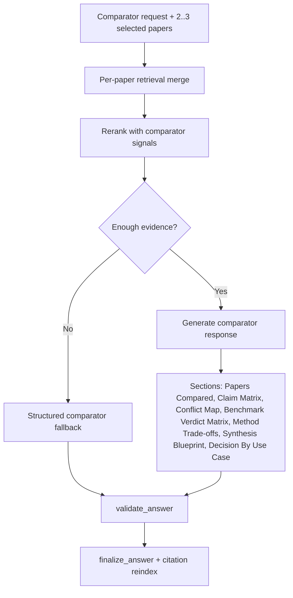

# Research Agent

Research Agent is a full-stack paper assistant built for practical research workflows: upload PDFs, run grounded QA, compare papers at claim level, draft in your own style, and run a structured reviewer panel.

This repository includes:

- React frontend (`research_agent.jsx`)
- FastAPI backend (`backend/src/research_agent`)
- LangGraph orchestration for retrieval, generation, and validation
- Hybrid retrieval (dense + sparse) with reranking
- Semantic chunking for long research PDFs

## What It Can Do

- `Local Brain`: strict paper-grounded QA with citations
- `Global Brain`: open answers with optional paper grounding
- `Paper Writer`: style-aware drafting and rewriting
- `Reviewer`: Claim Trial Engine (Skeptic vs Advocate + Judge + rewrite card)
- `Comparator`: claim-level paper comparison with decision outputs

## Runtime Graph (All Modes)



## Reviewer Graph (Claim Trial Engine)



Reviewer state persisted in runtime memory includes:

- `attack_vectors`, `active_vector_id`, `vectors_remaining`
- `debate_history`, `debate_summary`, `turn_count`, `next_speaker`
- `vector_verdicts`, `vector_judgments`, `vector_reports`
- `syntheses`, `final_report`

## Comparator Graph (Claim Matrix Lab)



## Documentation Map

- [Architecture Overview](docs/architecture.md)
- [Architecture Walkthrough](docs/architecture_walkthrough.md)
- [Graph State and Mode Graphs](docs/graph_state.md)

## Repository Layout

```text
.
|- research_agent.jsx
|- index.html
|- landing.html
|- dashboard.html
|- docs/
|  |- architecture.md
|  |- architecture_walkthrough.md
|  |- graph_state.md
|  |- graph_state.mmd
|  `- smoke_reports/
`- backend/
   |- README.md
   |- pyproject.toml
   |- .env.example
   |- stress_test_outputs.py
   `- src/research_agent/
      |- api.py
      |- runtime.py
      |- schemas.py
      |- config.py
      |- graph/
      |  |- state.py
      |  `- builder.py
      |- retrieval/
      |  |- ingestion.py
      |  |- chunking.py
      |  |- dense.py
      |  `- sparse.py
      `- services/
         |- text_generation.py
         |- groq_text.py
         |- gemini_text.py
         `- style_memory.py
```

## Quick Start

### 1) Prerequisites

- Python 3.11+
- Node.js (only needed for frontend tooling)
- Provider keys for generation/embeddings/vector DB

### 2) Backend Setup

From repo root:

```powershell
python -m venv .venv
.\.venv\Scripts\activate
pip install -e .\backend
Copy-Item .\backend\.env.example .\backend\.env
```

Run backend:

```powershell
.\.venv\Scripts\python.exe -m uvicorn research_agent.api:app --app-dir backend\src --host 127.0.0.1 --port 8010
```

Health check:

```powershell
Invoke-WebRequest -UseBasicParsing http://127.0.0.1:8010/health
```

### 3) Frontend Setup

The FastAPI app serves the homepage at `/` and the current dashboard at `/dashboard`.
After the backend is running, open:

- `http://127.0.0.1:8010/`
- `http://127.0.0.1:8010/dashboard`

## Smoke and Stress Checks

Local Brain smoke script:

```powershell
powershell -ExecutionPolicy Bypass -File .\scripts\smoke_local.ps1 -PdfPath "C:\Users\R Nishanth Reddy\Downloads\EEGMoE_A_Domain-Decoupled_Mixture-of-Experts_Model_for_Self-Supervised_EEG_Representation_Learning.pdf"
```

Reviewer/Comparator stress harness:

```powershell
python .\backend\stress_test_outputs.py
```

To save a report:

```powershell
python .\backend\stress_test_outputs.py > .\docs\smoke_reports\stress_latest.json
```

## Configuration

Key environment variables:

- `GROQ_API_KEY`
- `GEMINI_API_KEY`
- `OPENROUTER_API_KEY`
- `PINECONE_API_KEY`
- `GENERATION_PROVIDER` (`auto`, `groq`, `gemini`, `openrouter`)
- `GENERATION_FALLBACK_ORDER` (default: `gemini,openrouter,groq`)
- `GENERATION_PROVIDER_COOLDOWN_SECONDS` (default: `600`)
- `GROQ_MODEL` (default: `llama-3.3-70b-versatile`)
- `GEMINI_MODEL` (default: `gemini-2.0-flash`)
- `OPENROUTER_MODEL` (default: `openai/gpt-4o-mini`)
- `EMBEDDING_PROVIDER` (`local`, `auto`, `gemini`)

Important retrieval knobs:

- `retrieval_top_k`, `rerank_top_n`
- `hybrid_dense_top_k`, `hybrid_sparse_top_k`
- `hybrid_dense_weight`, `hybrid_sparse_weight`, `hybrid_rrf_k`
- `chunk_size`, `chunk_overlap`
- `semantic_unit_max_chars`, `semantic_similarity_floor`

Reviewer tuning knobs:

- `reviewer_attack_vector_count`
- `reviewer_max_turns`
- `reviewer_warning_turn`
- `reviewer_turns_per_response`

## API Surface

- `GET /health`
- `GET /api/papers`
- `POST /api/papers/upload`
- `DELETE /api/papers`
- `DELETE /api/papers/{paper_id}`
- `POST /api/papers/{paper_id}/re-ingest`
- `GET /api/style-profile`
- `POST /api/chat`
- `POST /api/retrieval/preview`

## Reliability Notes

- Retrieval is hybrid dense+sparse with reranking.
- If generation providers fail, runtime falls back to structured retrieval-only responses.
- Reviewer session state is in-memory; process restart clears it.

## Troubleshooting

- If output looks fallback-like, inspect `debug.model_fallback` and `debug.model_error`.
- If citations look weak, inspect `debug.retrieval_preview` and `debug.rerank_preview`.
- If Reviewer appears stuck, inspect `debug.active_vector_id`, `debug.next_speaker`, `debug.vectors_remaining`.
- If Comparator feels shallow, verify at least 2 papers selected and check `debug.retrieved_count`.

---

For implementation details, read [docs/architecture_walkthrough.md](docs/architecture_walkthrough.md).
