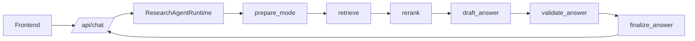

# Research Agent Architecture

This document is the short architecture brief. For full implementation detail, see:

- [Architecture Walkthrough](architecture_walkthrough.md)
- [Graph State](graph_state.md)

## System Shape

- Frontend: React single-file shell (`research_agent.jsx`)
- Backend API: FastAPI (`backend/src/research_agent/api.py`)
- Runtime orchestration: LangGraph (`backend/src/research_agent/graph/builder.py`)
- Retrieval: dense + sparse + rerank
- Dense vector store: Pinecone
- Generation providers: Groq, Gemini, OpenRouter (router + fallback order)

## End-to-End Graph

## Reviewer and Comparator Paths

The graph pipeline is shared, but `draft_answer` branches into specialized mode logic:

- `Reviewer`: Claim Trial Engine with attack vectors, Skeptic/Advocate turns, Evidence-only Judge, Rewrite Compiler card, and final panel report.
- `Comparator`: claim-level multi-paper comparison with strict section structure and fallback-safe structured output.

See diagrams in:

- [README Reviewer Graph](../README.md)
- [README Comparator Graph](../README.md)
- [Graph State](graph_state.md)

## Storage and State

Persistent on disk:

- uploaded PDFs
- extracted text/chunks metadata
- paper catalog
- style profile

Persistent in Pinecone:

- dense embedding vectors

In-memory runtime state:

- reviewer sessions keyed by `(session_id, review_paper_id)`
- fields include `vector_judgments`, `vector_reports`, `final_report`

## Why This Layout

- Keeps API keys and provider logic in backend only
- Makes retrieval and generation independently testable
- Supports deep mode-specific behavior without forking APIs
- Preserves explainability via debug payloads and citations
