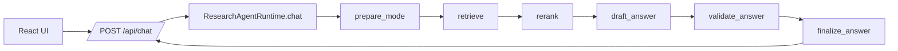
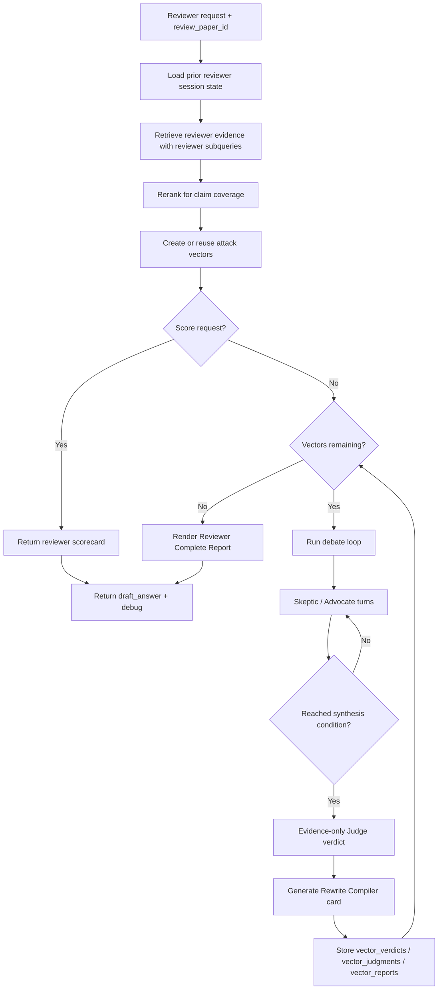
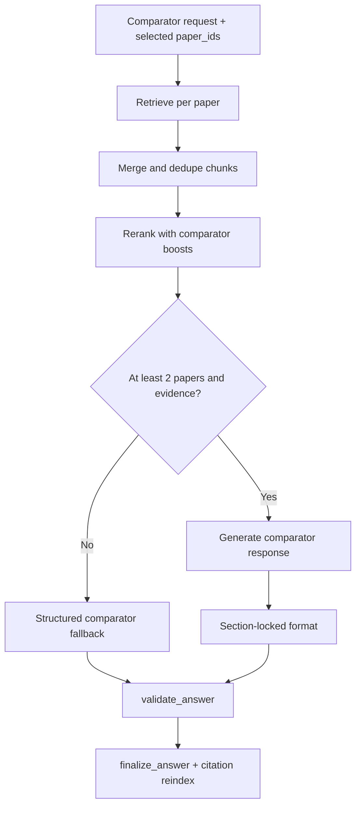

# Research Agent Architecture Walkthrough

This is the implementation-facing walkthrough for the current codebase.

## 1) Modes and Intent

Research Agent has five modes:

- `Local`: strict grounded QA from uploaded papers
- `Global`: open responses with optional paper grounding
- `Writer`: style-aware drafting
- `Reviewer`: Claim Trial Engine (Skeptic/Advocate/Judge/Rewrite)
- `Comparator`: claim-level multi-paper comparison

## 2) Shared Execution Graph

All modes run through the same LangGraph node order.



Compiled in `build_graph()` inside `backend/src/research_agent/graph/builder.py`.

## 3) Reviewer Flow (Claim Trial Engine)

Reviewer mode is implemented in `_run_reviewer_debate()` and persists state in runtime memory.



### Reviewer state carried across turns

- `attack_vectors`, `active_vector_id`, `vectors_remaining`
- `debate_history`, `debate_summary`, `turn_count`, `next_speaker`
- `syntheses`, `vector_verdicts`, `vector_judgments`, `vector_reports`, `final_report`

### Reviewer output shapes

- Active debate: `## Review Panel` with latest Skeptic/Advocate points, Judge card (when available), rewrite card, and next-step routing.
- Completed run: `## Reviewer Complete Report` with final decision, confidence, per-claim verdicts, author guidance, and transcripts.

## 4) Comparator Flow (Claim Matrix Lab)

Comparator mode is enforced in `_draft_user_prompt(..., mode=Mode.COMPARATOR)` and structured fallback paths.



Required comparator sections:

1. `## Papers Compared`
2. `## Claim Matrix`
3. `## Conflict Map`
4. `## Benchmark Verdict Matrix`
5. `## Method Trade-offs`
6. `## Synthesis Blueprint`
7. `## Decision By Use Case`

## 5) Node Responsibilities

### `prepare_mode`

- Sets mode-specific instruction scaffold
- Writes initial debug metadata

### `retrieve`

- `Reviewer`: reviewer-focused subqueries on selected review paper
- `Comparator`: per-paper retrieval merge (up to first 3 papers)
- `Local/Global/Writer`: generalized multi-subquery retrieval

### `rerank`

- scores by overlap, phrases, section quality, and mode focus terms
- reviewer/comparator get larger rerank windows for coverage

### `draft_answer`

- routes into reviewer engine or comparator generation
- handles strict mode validations (missing paper/evidence)
- applies provider fallback paths when model calls fail

### `validate_answer`

- model-based factual pass for regular paths
- bypasses for reviewer debate output (`reviewer_debate_mode`)

### `finalize_answer`

- chooses final answer text
- selects citations and reindexes inline markers
- writes terminal debug fields

## 6) Runtime Layer

`backend/src/research_agent/runtime.py` responsibilities:

- invoke graph with mode payload
- load/save reviewer session state by `(session_id, review_paper_id)`
- return safe structured fallback if graph invocation fails

Runtime-safe fallback includes reviewer/comparator-specific markdown scaffolds, not plain generic text.

## 7) Retrieval and Storage

Implemented pipeline:

- PDF ingest -> text extraction -> semantic chunking
- chunk metadata persisted locally
- dense vectors in Pinecone
- optional sparse lexical retrieval + fusion

Persistent local artifacts:

- `backend/storage/uploads`
- `backend/storage/papers`
- `backend/storage/chunks`
- style profile store

## 8) Debugging Guide

Useful `debug` keys from `/api/chat`:

- retrieval: `retrieval_preview`, `retrieval_scores`, `retrieved_count`
- rerank: `rerank_preview`, `reranked_count`
- model/fallback: `response_stage`, `model_fallback`, `model_error`
- reviewer: `active_vector_id`, `next_speaker`, `vectors_remaining`, `vector_verdicts`, `final_report_ready`

## 9) Stress Harness

`backend/stress_test_outputs.py` runs a compact stress suite:

- Reviewer multi-turn completion and final report readiness
- Local mode grounded numeric/math checks
- Global mode unrestricted answer checks
- Comparator section-marker checks

Run:

```powershell
python .\backend\stress_test_outputs.py
```

---

If behavior and docs diverge, treat `backend/src/research_agent/graph/builder.py` as source-of-truth and update this file.
