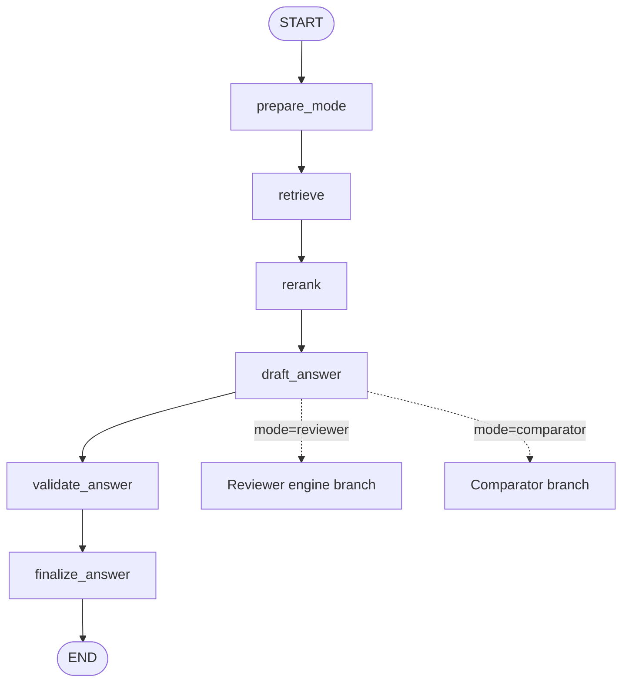
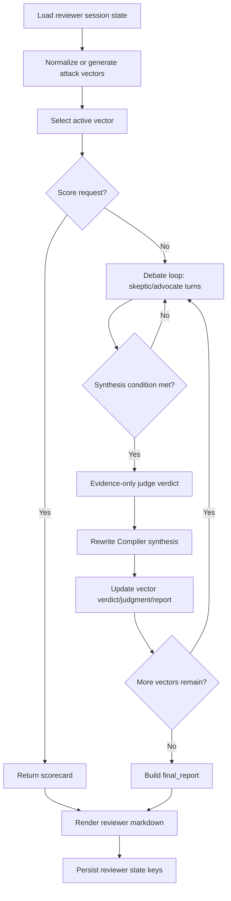
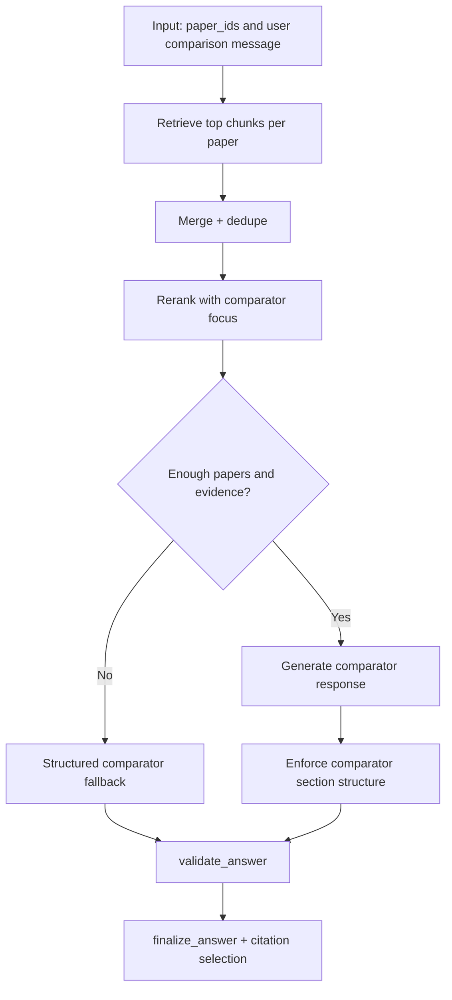

# LangGraph State Graph

This file documents the execution order and mode-specific branch behavior in:

- `backend/src/research_agent/graph/builder.py`
- `backend/src/research_agent/graph/state.py`

## 1) Shared Graph

## 2) Reviewer Branch Graph

## 3) Comparator Branch Graph

## 4) Exact Node Order

1. START: runtime invokes compiled graph with request payload.
2. `prepare_mode`: mode instruction + initial debug metadata.
3. `retrieve`: mode-specific retrieval strategy.
4. `rerank`: scoring and balanced selection.
5. `draft_answer`: mode branch execution (reviewer/comparator/local/global/writer).
6. `validate_answer`: validation model pass or branch-specific bypass.
7. `finalize_answer`: final answer + citations + debug.
8. END: return to runtime/API.

## 5) GraphState Fields

Core fields:

- `session_id`, `mode`, `message`, `paper_ids`, `review_paper_id`, `history`
- `mode_instructions`, `retrieved_documents`
- `draft_answer`, `validated_answer`, `validation_issues`
- `answer`, `citations`, `debug`

Reviewer fields:

- `attack_vectors`, `active_vector_id`, `vectors_remaining`
- `debate_history`, `debate_summary`
- `skeptic_position`, `advocate_position`, `resolution`, `turn_count`, `next_speaker`
- `syntheses`, `vector_verdicts`, `vector_judgments`, `vector_reports`, `final_report`
- `intervention_mode`

## 6) Persistence Notes

- Reviewer session keys are extracted with `extract_reviewer_state()` and stored in runtime memory.
- Reviewer state is scoped by `session_id::paper_id`.
- Clearing/deleting papers removes linked reviewer state.
